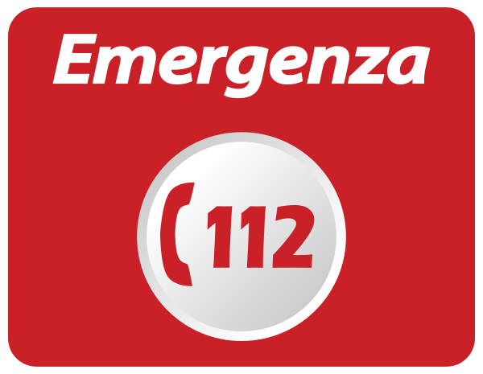

# Sicurezza e emergenze

## Numeri utili

In caso di emergenza, contattare i seguenti numeri:

- **Emergenze generali** (Carabinieri, Vigili del Fuoco, Ambulanza): 112
- **Ospedale di Asiago:**
  - Tel. 0424 604111
  - Via Martiri di Granezza 42, Asiago
- **Farmacia più vicina:** Farmacia Dr. Max
  - Tel. 0424 462072
  - Viale Giacomo Matteotti 44, Asiago

## 💧 Rubinetto generale

- In caso di problemi, il rubinetto generale dell'acqua si trova nel locale caldaia. Vi si accede dalla porta tra l'entrata principale e il giardino posteriore. Il rubinetto è quello grande nero in basso a destra, difronte alla porta.

## In caso di blackout

- La casa è dotata di un contatore con un limite di potenza, quindi la luce potrebbe saltare se si usano **più di due elettrodomestici** contemporaneamente: **lavatrice**, **lavastoviglie**, **forno**, **phon**.  
- Per evitare interruzioni, è consigliabile **non usare più di due di questi apparecchi nello stesso momento**.  
- Se la corrente salta:
  - Il **quadro elettrico principale** è in **garage**: entrando dalla porta interna, sulla sinistra.
  - Spegnere alcuni elettrodomestici e riattivare l'interruttore generale.

## Chiusura e sicurezza della casa

- Quando si esce, chiudere sempre porte e finestre.
- Non lasciare oggetti di valore incustoditi.
- Se si notano situazioni insolite, contattare il responsabile della casa.

## Estintori e dispositivi di sicurezza

- L’estintore si trova in [posizione].
- In sala è posizionato un **rilevatore di monossido di carbonio**, in caso di segnale acustico, aerare l’ambiente e verificare la situazione.

Per qualsiasi dubbio o necessità, non esitate a chiedere.
