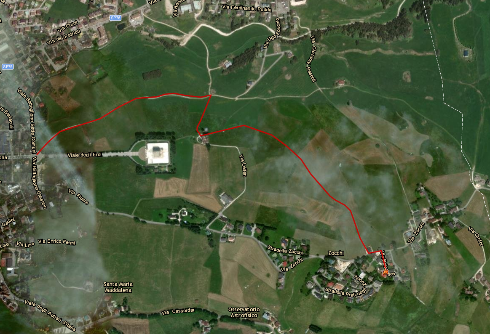

# Informazioni sulla zona

## 🏫 Centro di Asiago

### Strada asfaltata

È possibile raggiungere il centro di Asiago a piedi in circa 15-20 minuti (1,7 km) percorrendo la strada asfaltata che parte da via Belvedere, scendendo a sinistra.

### Sentiero

Alternativamente è possibile raggiungere il centro a piedi seguendo il sentiero 805 che parte dalla fine di via Belvedere, girando a sinistra per pochi metri e poi a destra per la carrareccia che scende tra i prati fino all'Ossario (20-25 minuti).

## 🛒 Supermercati

### Eurospar - Asiago

- **Indirizzo:** Via Rendola 38, Asiago
- **Telefono:** 0424 463849
- **Orari di apertura:**
  - Lunedì - Sabato: 08:00 - 19:30
  - Domenica: 08:30 - 19:00

È possibile raggiungere il supermercato a piedi per un sentiero che attraversa i prati, in circa 15 minuti (1,4 km).
Usciti da via Belvedere, girare a destra. Dopo la chiesetta, prendere la stradina bianca a sinistra tra le case.
Attenzione: ritorno in salita!

### A&O - Gallio

- **Indirizzo:** Via G. Prestinari 32, Gallio
- **Telefono:** 0424 445649

## ⚕️ Farmacie

### Farmacia Chimica Bortoli - Asiago

- **Indirizzo:** Piazza II Risorgimento 23, Asiago
- **Telefono:** 0424 462112

### Farmacia Dr.Max - Asiago

- **Indirizzo:** Viale G. Matteotti 44, Asiago
- **Telefono:** 0424 462072

### Farmacia di Gallio

- **Indirizzo:** Via G. Prestinari 32, Gallio
- **Telefono:** 0424 447919

## ℹ️ Ufficio Turistico di Asiago

- **Indirizzo:** Piazza Giovanni Carli 56, Asiago
- **Telefono:** 0424 462221
- **Email:** <info@asiago.to>
- **Sito web:** [www.asiago.to](https://www.asiago.to/)
